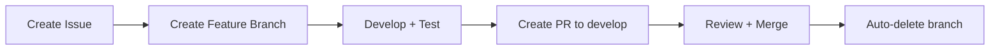

# 🚀 Developer Onboarding Checklist

**Version**: 2.0
**Last Updated**: 2025-10-16
**Purpose**: Role-specific onboarding guides for the Meta-Repo-Seed platform

Welcome to Meta-Repo Seed! This checklist will get you up and running quickly.

## ⚡ Quick Start (5 minutes)

### ✅ **Step 1: Environment Setup**
```bash
# Clone the repository
git clone https://github.com/ChrisClements1987/meta-repo-seed.git
cd meta-repo-seed

# Create virtual environment
python -m venv venv
# Windows: venv\Scripts\activate
# Linux/Mac: source venv/bin/activate

# Install dependencies
pip install -r requirements-dev.txt  # Includes runtime, test, and dev tools

# Verify setup works
python -m pytest --version
python seeding.py --help
```

### ✅ **Step 2: Understand the Project**
- **Purpose**: Creates "Business-in-a-Box" organizational infrastructure in 10 minutes
- **Target**: Startups, charities, non-profits, SMBs
- **Core Script**: `seeding.py` - idempotent project structure creation

### ✅ **Step 3: Test Everything Works**
```bash
# Run all tests (should pass)
python -m pytest

# Test the main script
python seeding.py --dry-run --verbose

# Check code style (if flake8 available)
python -m pytest --flake8
```

## 🧭 **Essential Reading Order**

Read these in order for fastest understanding:

1. **[Vision](vision.md)** - Project vision and goals (5 min)
2. **[Principles](principles.md)** - Core principles and values (3 min)
3. **[Development Workflow](../40-Operations/development-workflow.md)** - Git workflow (3 min)
4. **[Contributing Guide](contributing-guide.md)** - Contribution process (4 min)

**Total reading time: ~15 minutes**

## 🔄 **Development Workflow Summary**



### **Branch Strategy**
- `main` - Production releases only
- `develop` - Integration branch for all development
- `feature/issue-123-description` - Your work branches

### **PR Process**
1. **Always target `develop`** (never `main` directly)
2. Use appropriate PR template (feature/bugfix/documentation)
3. Meet requirements: tests + documentation + AI context (if applicable)
4. Branch auto-deletes when PR merged ✅

## 🧪 **Testing Philosophy**

- **TDD Preferred**: Write tests first when possible
- **Diff Coverage**: ≥80% coverage on changed lines required
- **Legacy Friendly**: Can mark failing tests as xfail with linked issues during stabilization
- **Test Types**: Unit (`tests/unit/`), Integration (`tests/integration/`)

```bash
# Run specific test types
python -m pytest tests/unit/
python -m pytest tests/integration/

# Check coverage on changes
python -m pytest --cov=src --cov-report=term-missing
```

---

## 👥 Role-Based Onboarding Paths

### **🚀 New Developer** (15 minutes)
**Goal**: Get up and running with development workflow

#### **Essential Reading Order**
1. **[Vision](vision.md)** - Project vision and goals (5 min)
2. **[Principles](principles.md)** - Core principles and values (3 min)
3. **[Development Workflow](../40-Operations/development-workflow.md)** - Git workflow (3 min)
4. **[Contributing Guide](contributing-guide.md)** - Contribution process (4 min)

#### **Quick Verification**
```bash
# Test everything works
python -m pytest
python seeding.py --dry-run --verbose
```

#### **First Contribution**
1. Create issue → Get issue number
2. `git checkout -b feature/issue-123-description`
3. Write tests first (TDD preferred)
4. Implement feature with ≥80% diff coverage
5. Update documentation
6. Create PR using feature template

**You're ready when**: You can run tests, understand the workflow, and know where to find help.

---

### **📊 Product Manager** (20 minutes)
**Goal**: Understand product strategy and roadmap

#### **Essential Reading Order**
1. **[Vision](vision.md)** - Project vision and goals (5 min)
2. **[Strategic Objectives](../10-Strategy/objectives.md)** - Business objectives (5 min)
3. **[Product Roadmap](../10-Strategy/roadmap.md)** - Development roadmap (5 min)
4. **[Market Analysis](../10-Strategy/market-analysis.md)** - Market positioning (5 min)

#### **Key Documents**
- **[Product Decision Records](../30-Product/PDR-index.md)** - Product decisions
- **[User Guides](../30-Product/user-guides/)** - User experience
- **[API Specification](../30-Product/api-specification.md)** - Technical capabilities

#### **Product Focus Areas**
- Customer onboarding experience
- Feature prioritization and roadmap
- User research and feedback integration
- Market positioning and competitive analysis

**You're ready when**: You understand the product vision, roadmap, and decision-making process.

---

### **🏗️ System Architect** (25 minutes)
**Goal**: Understand technical architecture and standards

#### **Essential Reading Order**
1. **[Vision](vision.md)** - Project vision and goals (5 min)
2. **[Architecture Principles](../20-Architecture/principles.md)** - Technical principles (5 min)
3. **[System Architecture](../20-Architecture/system-architecture.md)** - Technical design (10 min)
4. **[Technical Standards](../20-Architecture/technical-standards.md)** - Development standards (5 min)

#### **Key Documents**
- **[Architecture Decision Records](../20-Architecture/ADR-index.md)** - Technical decisions
- **[API Design](../20-Architecture/api-design.md)** - API architecture
- **[Security Model](../20-Architecture/security-model.md)** - Security architecture

#### **Architecture Focus Areas**
- Multi-tenant SaaS architecture
- API design and integration
- Security and compliance
- Scalability and performance

**You're ready when**: You understand the technical architecture, standards, and decision-making process.

---

### **⚙️ Operations Engineer** (20 minutes)
**Goal**: Understand operational processes and procedures

#### **Essential Reading Order**
1. **[Vision](vision.md)** - Project vision and goals (5 min)
2. **[Operational Principles](../40-Operations/principles.md)** - Operational principles (5 min)
3. **[Development Workflow](../40-Operations/development-workflow.md)** - Development processes (5 min)
4. **[Runbooks](../40-Operations/runbooks/)** - Operational procedures (5 min)

#### **Key Documents**
- **[Operational Decision Records](../40-Operations/OPR-index.md)** - Process decisions
- **[CI/CD Standards](../40-Operations/ci-cd-standards.md)** - Deployment processes
- **[Monitoring and Metrics](../40-Operations/metrics/)** - Operational monitoring

#### **Operations Focus Areas**
- Development workflow and processes
- CI/CD and deployment automation
- Monitoring and incident response
- Performance and reliability

**You're ready when**: You understand the operational processes, procedures, and decision-making framework.

---

### **🤖 AI Agent** (10 minutes)
**Goal**: Understand AI integration and governance

#### **Essential Reading Order**
1. **[Vision](vision.md)** - Project vision and goals (3 min)
2. **[AI Integration Guidelines](../60-AI/integration-guidelines.md)** - AI integration (4 min)
3. **[AI Safety Guardrails](../60-AI/safety-guardrails.md)** - Safety measures (3 min)

#### **Key Documents**
- **[AI Decision Records](../60-AI/AIR-index.md)** - AI governance decisions
- **[Agent Handbooks](../60-AI/agent-handbooks/)** - Agent-specific guidance
- **[Prompt Patterns](../60-AI/prompt-patterns.md)** - Standardized patterns

#### **AI Focus Areas**
- Agent autonomy and decision-making boundaries
- Safety measures and ethical guidelines
- Integration with development workflows
- Performance monitoring and evaluation

**You're ready when**: You understand AI governance, safety measures, and integration requirements.

---

### **👔 Executive/Stakeholder** (15 minutes)
**Goal**: Understand business strategy and governance

#### **Essential Reading Order**
1. **[Vision](vision.md)** - Project vision and goals (5 min)
2. **[Strategic Objectives](../10-Strategy/objectives.md)** - Business objectives (5 min)
3. **[Governance Framework](../50-Governance/framework.md)** - Governance structure (5 min)

#### **Key Documents**
- **[Strategic Decision Records](../10-Strategy/SDR-index.md)** - Strategic decisions
- **[Governance Decision Records](../50-Governance/GDR-index.md)** - Governance decisions
- **[Risk Register](../50-Governance/risk-register.md)** - Risk management

#### **Executive Focus Areas**
- Business strategy and market positioning
- Risk management and compliance
- Resource allocation and priorities
- Stakeholder communication and reporting

**You're ready when**: You understand the business strategy, governance framework, and decision-making process.

---

## 🔄 Common Workflows

### **Development Workflow**


### **Decision Making Process**
1. **Identify Decision Type** - SDR/ADR/PDR/OPR/GDR/AIR/MDR
2. **Create Decision Record** - Use appropriate template
3. **Gather Input** - Stakeholders, research, analysis
4. **Make Decision** - Document rationale and consequences
5. **Implement** - Execute decision with monitoring
6. **Review** - Regular assessment and updates

---

## 🧪 Testing Philosophy

- **TDD Preferred**: Write tests first when possible
- **Diff Coverage**: ≥80% coverage on changed lines required
- **Legacy Friendly**: Can mark failing tests as xfail with linked issues
- **Test Types**: Unit, Integration, End-to-End

```bash
# Run specific test types
python -m pytest tests/unit/
python -m pytest tests/integration/

# Check coverage on changes
python -m pytest --cov=src --cov-report=term-missing
```

---

## 🛠️ Project Structure

```
meta-repo-seed/
├── seeding.py              # Main script - start here
├── src/                    # Core modules
│   ├── commercial/         # Multi-tenant SaaS infrastructure
│   ├── structure_parser/   # JSON schema validation
│   ├── automation/         # Automation scripts
│   └── meta_repo_seed/     # Core package
├── docs-new/               # New hierarchical documentation
│   ├── 00-Foundation/      # Core principles and onboarding
│   ├── 10-Strategy/        # Strategic direction
│   ├── 20-Architecture/    # Technical architecture
│   ├── 30-Product/         # Product and UX
│   ├── 40-Operations/      # Operational processes
│   ├── 50-Governance/      # Compliance and ethics
│   ├── 60-AI/              # AI integration
│   ├── 70-Communications/   # External content
│   └── 80-Meta/            # System governance
├── templates/              # Jinja2 templates for generation
├── tests/                  # Test suite
└── scripts/                # Utility scripts
```

---

## 🚨 Red Flags / Don't Do This

❌ **NEVER target `main` directly** with feature PRs
❌ **Don't bypass decision record process** for significant decisions
❌ **Don't commit without tests** - ensure ≥80% diff coverage
❌ **Don't break existing tests** without documenting with xfail + linked issue
❌ **Don't ignore safety guidelines** for AI integration

---

## 🆘 Getting Help

- **Commands not working?** Check [AGENTS.md](../../AGENTS.md) for current syntax
- **Workflow questions?** See [Development Workflow](../40-Operations/development-workflow.md)
- **Decision making?** Check appropriate decision record index
- **Architecture questions?** See [Architecture docs](../20-Architecture/)
- **Still stuck?** Create issue with `help-wanted` label

---

## ✅ Success Criteria

### **Developer Ready When**
- [ ] Can run tests and main script successfully
- [ ] Understands development workflow
- [ ] Knows where to find documentation
- [ ] Can create first contribution

### **Product Manager Ready When**
- [ ] Understands product vision and roadmap
- [ ] Knows decision-making process
- [ ] Can access user research and feedback
- [ ] Understands market positioning

### **Architect Ready When**
- [ ] Understands technical architecture
- [ ] Knows technical standards and principles
- [ ] Can access architecture decisions
- [ ] Understands security and compliance

### **Operations Ready When**
- [ ] Understands operational processes
- [ ] Knows CI/CD and deployment procedures
- [ ] Can access runbooks and procedures
- [ ] Understands monitoring and metrics

### **AI Agent Ready When**
- [ ] Understands AI governance framework
- [ ] Knows safety measures and guidelines
- [ ] Can access agent handbooks
- [ ] Understands integration requirements

### **Executive Ready When**
- [ ] Understands business strategy
- [ ] Knows governance framework
- [ ] Can access strategic decisions
- [ ] Understands risk management

---

**🎉 Welcome to Meta-Repo-Seed! Choose your path and start contributing to Business-in-a-Box infrastructure.**

*This onboarding guide is maintained to stay current. If something is outdated, please update it as part of your first contribution!*
