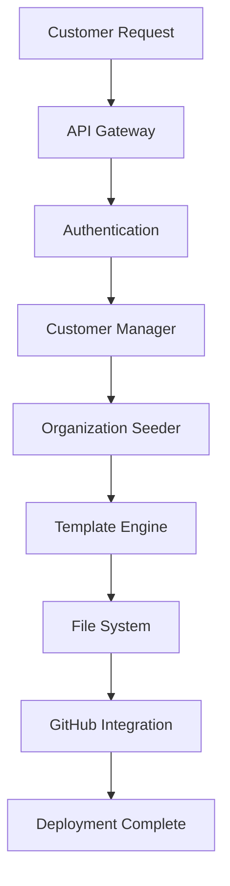
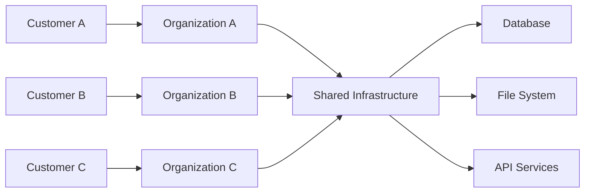

# System Architecture

**Version**: 2.0
**Last Updated**: 2025-10-16
**Purpose**: Technical architecture overview for Meta-Repo-Seed platform

---

## 🏗️ Architecture Overview

The Meta-Repo-Seed platform follows a modular, multi-tenant architecture designed for:

- **Idempotent Operations** - Safe to run multiple times without side effects
- **Cross-Platform Support** - Windows, macOS, Linux compatibility
- **Template-Driven Generation** - Flexible content generation with Jinja2
- **Security-First Design** - Path traversal protection and input sanitization
- **Multi-Tenant SaaS** - Customer isolation and organization-centric design

---

## 🎯 Key Design Principles

### **1. Business-in-a-Box Focus**
Every component serves the 10-minute deployment goal, enabling rapid organizational infrastructure setup.

### **2. Professional Standards**
Enterprise-grade quality in all outputs, meeting professional technology company standards.

### **3. Self-Governing Systems**
Automated compliance and quality enforcement with minimal manual intervention.

### **4. Incremental Adoption**
Support legacy systems while encouraging modern practices and gradual migration.

### **5. AI-Assisted Development**
Clear patterns for AI understanding and assistance in development workflows.

---

## 🏛️ System Components

### **Core Platform Layer**

#### **Repository Seeding Engine**
- **Purpose**: Generate complete organizational structures from templates
- **Technology**: Python with Jinja2 templating
- **Features**: Idempotent operations, cross-platform support, template validation

#### **Template System**
- **Purpose**: Flexible content generation for different business types
- **Technology**: Jinja2 templates with variable substitution
- **Features**: Conditional logic, inheritance, custom filters

#### **Structure Parser**
- **Purpose**: Validate and process JSON schema definitions
- **Technology**: Python with JSON schema validation
- **Features**: Schema validation, error reporting, type checking

### **Commercial SaaS Layer**

#### **Multi-Tenant Architecture**
- **Purpose**: Support multiple customers with isolated data
- **Technology**: Organization-centric design with `org_id` scoping
- **Features**: Customer isolation, shared infrastructure, scalable design

#### **Customer Management System**
- **Purpose**: Complete customer lifecycle management
- **Technology**: PostgreSQL database with REST API
- **Features**: Customer onboarding, subscription management, settings

#### **API Infrastructure**
- **Purpose**: Programmatic access and integrations
- **Technology**: FastAPI with OpenAPI documentation
- **Features**: REST endpoints, authentication, rate limiting

---

## 🔄 Data Flow Architecture

### **Deployment Flow**

### **Multi-Tenant Data Isolation**

---

## 🗄️ Data Architecture

### **Database Schema**

#### **Customers Table**
- `customer_id` (Primary Key)
- `email` (Unique)
- `company_name`
- `status` (trial, active, suspended)
- `plan` (startup, growth, scale, enterprise)
- `created_at`, `updated_at`

#### **Organizations Table**
- `org_id` (Primary Key)
- `customer_id` (Foreign Key)
- `name`
- `status` (creating, active, suspended)
- `configuration` (JSON)
- `created_at`, `updated_at`

#### **Subscriptions Table**
- `subscription_id` (Primary Key)
- `customer_id` (Foreign Key)
- `plan`
- `status` (active, cancelled, expired)
- `start_date`, `end_date`

#### **Usage Metrics Table**
- `metric_id` (Primary Key)
- `org_id` (Foreign Key)
- `metric_type`
- `value`
- `timestamp`

---

## 🔐 Security Architecture

### **Authentication & Authorization**
- **JWT Tokens**: Stateless authentication for API access
- **Role-Based Access**: Customer, admin, system roles
- **Organization Scoping**: All operations scoped to customer's organizations

### **Data Protection**
- **Encryption**: Data encrypted at rest and in transit
- **Isolation**: Customer data isolated by organization
- **Audit Logging**: All operations logged for compliance

### **Input Validation**
- **Path Traversal Protection**: Prevent directory traversal attacks
- **Input Sanitization**: Clean and validate all user inputs
- **Schema Validation**: JSON schema validation for all data

---

## 🚀 Deployment Architecture

### **Infrastructure Components**

#### **Application Layer**
- **Web API**: FastAPI application with async support
- **CLI Tools**: Command-line interface for administrative tasks
- **Background Jobs**: Celery for async task processing

#### **Data Layer**
- **Primary Database**: PostgreSQL for transactional data
- **Cache Layer**: Redis for session storage and caching
- **File Storage**: Local filesystem with backup to cloud storage

#### **Integration Layer**
- **GitHub API**: Repository creation and management
- **Email Service**: Customer notifications and alerts
- **Monitoring**: Application and infrastructure monitoring

### **Scalability Considerations**
- **Horizontal Scaling**: Stateless API services
- **Database Scaling**: Read replicas and connection pooling
- **Caching Strategy**: Multi-level caching for performance
- **Load Balancing**: Multiple API instances behind load balancer

---

## 🔧 Technology Stack

### **Backend Technologies**
- **Python 3.8+**: Core application language
- **FastAPI**: Web API framework
- **PostgreSQL**: Primary database
- **Redis**: Caching and session storage
- **Celery**: Background task processing

### **Frontend Technologies**
- **CLI**: Python Click framework
- **Web Dashboard**: React/Next.js (future)
- **Documentation**: Markdown with automated generation

### **DevOps & Infrastructure**
- **Docker**: Containerization
- **GitHub Actions**: CI/CD pipeline
- **Monitoring**: Prometheus, Grafana
- **Logging**: Structured logging with ELK stack

---

## 📊 Performance Requirements

### **Response Time Targets**
- **API Endpoints**: < 200ms average response time
- **CLI Commands**: < 10 seconds for full deployment
- **Database Queries**: < 100ms for simple queries

### **Scalability Targets**
- **Concurrent Users**: 1000+ simultaneous users
- **Organizations**: 10,000+ organizations per customer
- **Throughput**: 1000+ API requests per second

### **Reliability Targets**
- **Uptime**: 99.9% availability
- **Data Durability**: 99.999% data retention
- **Recovery Time**: < 1 hour for service restoration

---

## 🔄 Evolution Roadmap

### **Phase 1: Foundation (Current)**
- Multi-tenant architecture implementation
- Basic customer management
- REST API with core endpoints
- PostgreSQL database integration

### **Phase 2: Advanced Features**
- Enterprise security features (SSO, audit logs)
- Advanced monitoring and analytics
- White-labeling capabilities
- Performance optimization

### **Phase 3: Scale & Intelligence**
- AI-powered automation
- Predictive analytics
- Advanced integrations
- Global deployment

---

## 📚 Related Documents

- [Architecture Decision Records](adr/) - Technical decision documentation
- [API Design](api-design.md) - API architecture and specifications
- [Security Model](security-model.md) - Security architecture details
- [Technical Standards](technical-standards.md) - Development standards

---

**This architecture document provides the technical foundation for the Meta-Repo-Seed platform's evolution into a commercial SaaS offering.**
