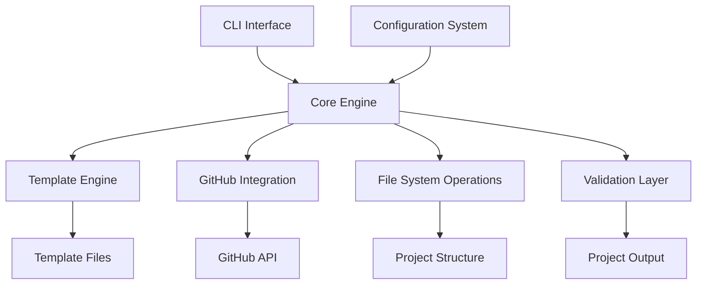
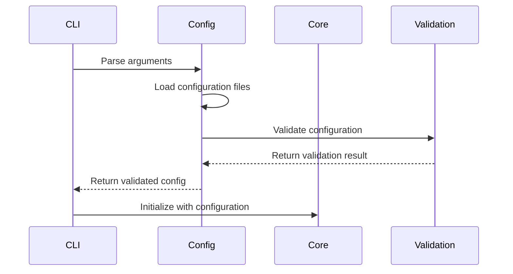
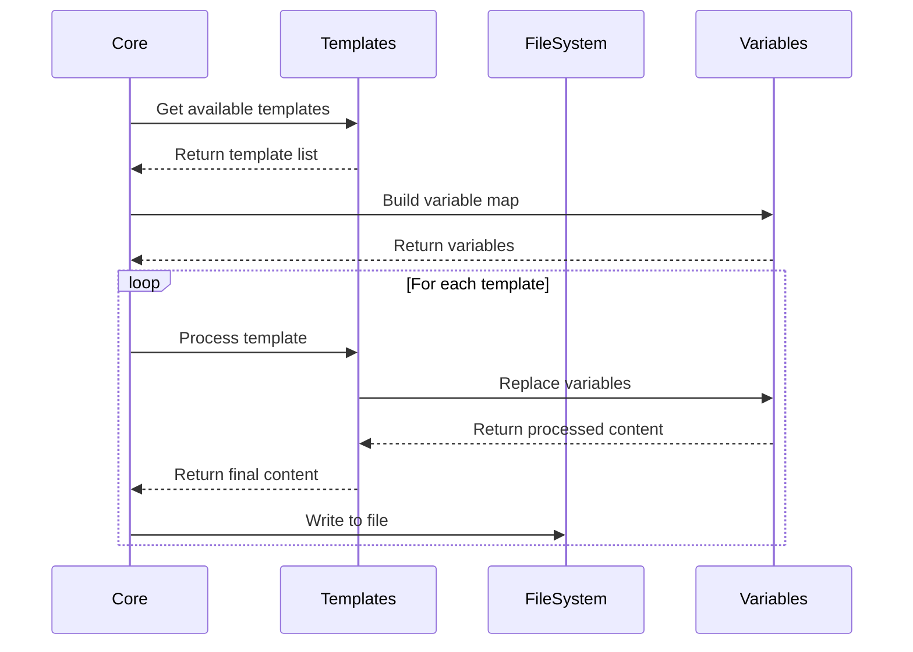
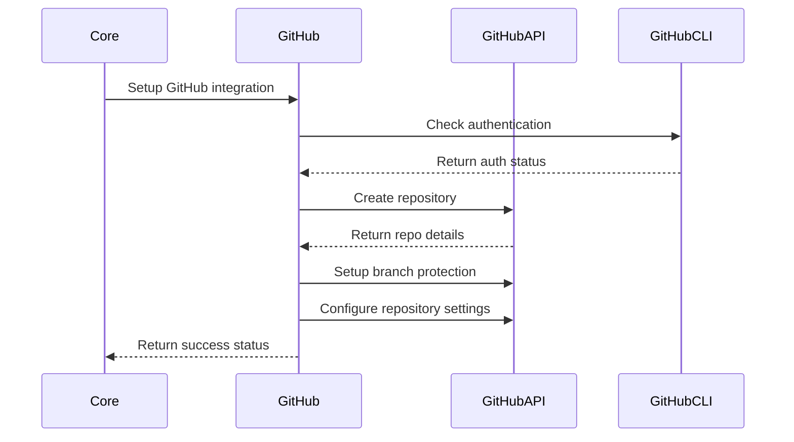

# System Architecture

This document describes the architectural design and structure of the Meta-Repo Seed system.

## 🏗️ System Overview

Meta-Repo Seed is a modular, extensible system for creating standardized project structures with comprehensive governance and automation frameworks. The architecture follows clean code principles with clear separation of concerns.



## 🧩 Core Components

### 1. CLI Interface (`seeding.py`)

**Purpose**: Command-line interface for user interaction
**Responsibilities**:
- Parse command-line arguments
- Validate user input
- Orchestrate the seeding process
- Handle error reporting

```python
class CLIInterface:
    """Command-line interface for the seeding system."""
    
    def __init__(self):
        self.parser = argparse.ArgumentParser()
        self.setup_arguments()
    
    def setup_arguments(self):
        """Configure CLI arguments and options."""
        
    def parse_args(self) -> argparse.Namespace:
        """Parse and validate command-line arguments."""
        
    def run(self) -> int:
        """Execute the seeding process and return exit code."""
```

### 2. Core Engine (`RepoSeeder`)

**Purpose**: Central orchestrator for all seeding operations
**Responsibilities**:
- Coordinate all system components
- Manage the seeding workflow
- Handle error propagation and recovery
- Provide idempotent operations

```python
class RepoSeeder:
    """Main class for repository seeding operations."""
    
    def __init__(self, config: Configuration):
        self.config = config
        self.template_engine = TemplateEngine()
        self.github_client = GitHubClient()
        self.file_manager = FileSystemManager()
    
    def seed_repository(self) -> bool:
        """Execute the complete seeding workflow."""
        
    def create_directory_structure(self) -> None:
        """Create the basic directory structure."""
        
    def process_templates(self) -> None:
        """Process all selected templates."""
        
    def setup_github_integration(self) -> None:
        """Configure GitHub integration features."""
```

### 3. Configuration System (`Configuration`)

**Purpose**: Manage project configuration and settings
**Responsibilities**:
- Load and validate configuration files
- Provide configuration access interface
- Handle configuration merging and inheritance
- Support multiple formats (YAML, JSON)

```python
class Configuration:
    """Configuration management system."""
    
    def __init__(self, config_file: str = None):
        self.data = {}
        self.schema = ConfigurationSchema()
        
    def load_config(self, config_file: str) -> None:
        """Load configuration from file with validation."""
        
    def get(self, key: str, default: Any = None) -> Any:
        """Get configuration value with dot notation support."""
        
    def set(self, key: str, value: Any) -> None:
        """Set configuration value with validation."""
        
    def merge(self, other_config: 'Configuration') -> None:
        """Merge another configuration into this one."""
```

### 4. Template Engine

**Purpose**: Process templates with variable substitution
**Responsibilities**:
- Load template files from multiple sources
- Perform variable replacement
- Support conditional template logic
- Validate template syntax

```python
class TemplateEngine:
    """Template processing and variable substitution."""
    
    def __init__(self, template_paths: List[str]):
        self.template_paths = template_paths
        self.template_cache = {}
        
    def process_template(self, template_name: str, variables: Dict[str, str], output_path: str) -> None:
        """Process a template with variable substitution."""
        
    def get_available_templates(self) -> List[str]:
        """Get list of all available templates."""
        
    def validate_template(self, template_path: str) -> Tuple[bool, List[str]]:
        """Validate template syntax and variables."""
```

### 5. GitHub Integration

**Purpose**: Interface with GitHub API and CLI
**Responsibilities**:
- Repository creation and management
- Branch protection setup
- Team and permissions management
- Webhook and integration configuration

```python
class GitHubClient:
    """GitHub API and CLI integration."""
    
    def __init__(self, username: str, token: str = None):
        self.username = username
        self.token = token
        
    def create_repository(self, repo_name: str, private: bool = False) -> bool:
        """Create a new GitHub repository."""
        
    def setup_branch_protection(self, repo_name: str, branch: str = "main") -> bool:
        """Configure branch protection rules."""
        
    def setup_repository_settings(self, repo_name: str, settings: Dict) -> bool:
        """Configure repository settings and features."""
```

### 6. File System Manager

**Purpose**: Handle all file system operations
**Responsibilities**:
- Create directories and files
- Manage file backups
- Ensure idempotent operations
- Cross-platform path handling

```python
class FileSystemManager:
    """Cross-platform file system operations."""
    
    def __init__(self, dry_run: bool = False):
        self.dry_run = dry_run
        
    def create_file(self, file_path: str, content: str, backup: bool = False) -> None:
        """Create or update a file with optional backup."""
        
    def create_directory(self, dir_path: str) -> None:
        """Create directory structure if it doesn't exist."""
        
    def backup_file(self, file_path: str) -> str:
        """Create backup of existing file."""
```

## 🔄 Data Flow Architecture

### Input Processing Flow



### Template Processing Flow



### GitHub Integration Flow



## 🏛️ Design Patterns

### 1. Strategy Pattern (Template Selection)

Different template processing strategies based on project type:

```python
class TemplateStrategy:
    """Abstract strategy for template processing."""
    
    def get_templates(self) -> List[str]:
        """Return list of templates for this strategy."""
        pass
    
    def get_variables(self, config: Configuration) -> Dict[str, str]:
        """Return strategy-specific variables."""
        pass

class WebApplicationStrategy(TemplateStrategy):
    """Template strategy for web applications."""
    
    def get_templates(self) -> List[str]:
        return ["gitignore", "github_workflows", "governance", "documentation"]

class DataScienceStrategy(TemplateStrategy):
    """Template strategy for data science projects."""
    
    def get_templates(self) -> List[str]:
        return ["gitignore", "jupyter", "conda_environment", "documentation"]
```

### 2. Factory Pattern (Configuration Loading)

Factory for creating configuration objects based on file format:

```python
class ConfigurationFactory:
    """Factory for creating configuration objects."""
    
    @staticmethod
    def create_configuration(config_file: str) -> Configuration:
        """Create configuration based on file extension."""
        if config_file.endswith('.yml') or config_file.endswith('.yaml'):
            return YAMLConfiguration(config_file)
        elif config_file.endswith('.json'):
            return JSONConfiguration(config_file)
        else:
            raise UnsupportedConfigurationFormat(config_file)
```

### 3. Observer Pattern (Progress Reporting)

Observers for progress reporting and logging:

```python
class ProgressObserver:
    """Abstract observer for progress reporting."""
    
    def on_start(self, total_steps: int): pass
    def on_step(self, step: int, description: str): pass
    def on_complete(self): pass
    def on_error(self, error: Exception): pass

class VerboseProgressObserver(ProgressObserver):
    """Progress observer with verbose output."""
    
    def on_step(self, step: int, description: str):
        print(f"[{step}] {description}")
```

### 4. Command Pattern (Operations)

Commands for different seeding operations:

```python
class SeedingCommand:
    """Abstract command for seeding operations."""
    
    def execute(self) -> bool: pass
    def undo(self) -> bool: pass

class CreateDirectoryCommand(SeedingCommand):
    """Command to create directory structure."""
    
    def __init__(self, directory_path: str):
        self.directory_path = directory_path
        
    def execute(self) -> bool:
        """Create the directory."""
        os.makedirs(self.directory_path, exist_ok=True)
        return True
```

## 🔧 Extension Points

### 1. Custom Templates

Add custom templates by implementing the template interface:

```python
class CustomTemplate:
    """Interface for custom templates."""
    
    def get_template_content(self) -> str:
        """Return template content."""
        pass
    
    def get_required_variables(self) -> List[str]:
        """Return list of required variables."""
        pass
    
    def process(self, variables: Dict[str, str]) -> str:
        """Process template with variables."""
        pass
```

### 2. Integration Plugins

Extend GitHub integration with custom plugins:

```python
class GitHubIntegrationPlugin:
    """Abstract plugin for GitHub integration."""
    
    def setup(self, repo_name: str, config: Configuration) -> bool:
        """Setup integration for repository."""
        pass
    
    def cleanup(self, repo_name: str) -> bool:
        """Cleanup integration resources."""
        pass
```

### 3. Validation Hooks

Custom validation logic:

```python
class ValidationHook:
    """Abstract validation hook."""
    
    def validate_configuration(self, config: Configuration) -> List[str]:
        """Validate configuration and return errors."""
        pass
    
    def validate_project_structure(self, project_path: str) -> List[str]:
        """Validate project structure and return errors."""
        pass
```

## 📊 Performance Considerations

### 1. Template Caching

Templates are cached in memory to avoid repeated file I/O:

```python
class TemplateCache:
    """Template caching system."""
    
    def __init__(self, max_size: int = 100):
        self.cache = {}
        self.max_size = max_size
        
    def get(self, template_path: str) -> str:
        """Get cached template or load from file."""
        if template_path not in self.cache:
            if len(self.cache) >= self.max_size:
                self._evict_oldest()
            self.cache[template_path] = self._load_template(template_path)
        return self.cache[template_path]
```

### 2. Parallel Processing

Template processing can be parallelized for large projects:

```python
import concurrent.futures

def process_templates_parallel(templates: List[str], variables: Dict[str, str]) -> None:
    """Process multiple templates in parallel."""
    with concurrent.futures.ThreadPoolExecutor(max_workers=4) as executor:
        futures = [
            executor.submit(process_template, template, variables)
            for template in templates
        ]
        concurrent.futures.wait(futures)
```

### 3. Memory Management

Efficient memory usage for large template processing:

```python
class StreamingTemplateProcessor:
    """Memory-efficient template processor."""
    
    def process_large_template(self, template_path: str, variables: Dict[str, str]) -> Iterator[str]:
        """Process large templates as streams."""
        with open(template_path, 'r') as file:
            for line in file:
                yield self._replace_variables(line, variables)
```

## 🔐 Security Architecture

### 1. Input Validation

All user input is validated to prevent injection attacks:

```python
class InputValidator:
    """Validates user input for security."""
    
    def validate_project_name(self, name: str) -> bool:
        """Validate project name against security rules."""
        return re.match(r'^[a-zA-Z0-9\-_]{1,100}$', name) is not None
    
    def validate_file_path(self, path: str) -> bool:
        """Validate file paths to prevent directory traversal."""
        normalized = os.path.normpath(path)
        return not normalized.startswith(('..', '/', '\\'))
```

### 2. Secrets Management

Sensitive information is handled securely:

```python
class SecretsManager:
    """Manages sensitive configuration data."""
    
    def __init__(self):
        self.secrets = {}
        
    def set_secret(self, key: str, value: str) -> None:
        """Store secret securely (in memory only)."""
        self.secrets[key] = value
        
    def get_secret(self, key: str) -> str:
        """Retrieve secret value."""
        return self.secrets.get(key)
```

## 🧪 Testing Architecture

### 1. Test Structure

Tests are organized by component and scope:

```
tests/
├── unit/                   # Unit tests for individual components
│   ├── test_configuration.py
│   ├── test_template_engine.py
│   └── test_github_client.py
├── integration/            # Integration tests
│   ├── test_seeding_workflow.py
│   └── test_github_integration.py
├── e2e/                   # End-to-end tests
│   ├── test_full_workflow.py
│   └── test_real_repositories.py
└── fixtures/              # Test data and fixtures
    ├── configs/
    ├── templates/
    └── expected_output/
```

### 2. Test Doubles

Mock objects for external dependencies:

```python
class MockGitHubClient:
    """Mock GitHub client for testing."""
    
    def __init__(self):
        self.created_repos = []
        self.branch_protections = []
        
    def create_repository(self, repo_name: str, private: bool = False) -> bool:
        """Mock repository creation."""
        self.created_repos.append({'name': repo_name, 'private': private})
        return True
```

### 3. Test Configuration

Isolated test environments:

```python
class TestEnvironment:
    """Manages isolated test environment."""
    
    def __init__(self):
        self.temp_dir = tempfile.mkdtemp()
        self.config = self._create_test_config()
        
    def cleanup(self):
        """Clean up test environment."""
        shutil.rmtree(self.temp_dir)
```

## 🚀 Deployment Architecture

### 1. Distribution

The system can be distributed in multiple ways:

- **Standalone Script**: Single `seeding.py` file with embedded templates
- **Python Package**: Installable pip package with separate template files
- **Docker Container**: Containerized version for CI/CD environments
- **GitHub Action**: Pre-built action for GitHub workflows

### 2. Configuration Management

Support for different configuration sources:

```python
class ConfigurationSource:
    """Abstract configuration source."""
    
    def load(self) -> Dict: pass

class FileConfigurationSource(ConfigurationSource):
    """Load configuration from file."""
    
class EnvironmentConfigurationSource(ConfigurationSource):
    """Load configuration from environment variables."""
    
class RemoteConfigurationSource(ConfigurationSource):
    """Load configuration from remote source."""
```

## 📈 Scalability Considerations

### 1. Large Organizations

Architecture supports scaling to large organizations:

- **Template Repositories**: Centralized template management
- **Configuration Inheritance**: Organizational defaults with project overrides
- **Batch Processing**: Process multiple projects simultaneously
- **Audit Logging**: Track all seeding operations

### 2. Performance Optimization

Optimizations for large-scale usage:

- **Template Compilation**: Pre-compile templates for faster processing
- **Incremental Updates**: Only process changed templates
- **Caching Strategies**: Multi-level caching for templates and configurations
- **Resource Pooling**: Reuse expensive resources like GitHub clients

---

*This architecture document is maintained alongside the codebase to ensure accuracy and relevance.*