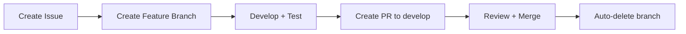

# 🚀 Developer Onboarding Checklist

Welcome to Meta-Repo Seed! This checklist will get you up and running quickly.

## ⚡ Quick Start (5 minutes)

### ✅ **Step 1: Environment Setup**
```bash
# Clone the repository
git clone https://github.com/ChrisClements1987/meta-repo-seed.git
cd meta-repo-seed

# Create virtual environment  
python -m venv venv
# Windows: venv\Scripts\activate
# Linux/Mac: source venv/bin/activate

# Install dependencies
pip install -r requirements-test.txt

# Verify setup works
python -m pytest --version
python seeding.py --help
```

### ✅ **Step 2: Understand the Project**
- **Purpose**: Creates "Business-in-a-Box" organizational infrastructure in 10 minutes
- **Target**: Startups, charities, non-profits, SMBs
- **Core Script**: `seeding.py` - idempotent project structure creation

### ✅ **Step 3: Test Everything Works**
```bash
# Run all tests (should pass)
python -m pytest

# Test the main script
python seeding.py --dry-run --verbose

# Check code style (if flake8 available)
python -m pytest --flake8
```

## 🧭 **Essential Reading Order**

Read these in order for fastest understanding:

1. **[Project North Star](../PROJECT_NORTH_STAR.md)** - Vision and goals (5 min)
2. **[Agent Instructions](../../AGENTS.md)** - Commands and patterns (2 min)  
3. **[Development Workflow](./DEVELOPMENT_WORKFLOW.md)** - Git workflow (3 min)
4. **[PR Templates](../../.github/pull_request_template.md)** - What's expected in PRs (5 min)

**Total reading time: ~15 minutes**

## 🔄 **Development Workflow Summary**



### **Branch Strategy**
- `main` - Production releases only
- `develop` - Integration branch for all development
- `feature/issue-123-description` - Your work branches

### **PR Process** 
1. **Always target `develop`** (never `main` directly)
2. Use appropriate PR template (feature/bugfix/documentation)
3. Meet requirements: tests + documentation + AI context (if applicable)
4. Branch auto-deletes when PR merged ✅

## 🧪 **Testing Philosophy**

- **TDD Preferred**: Write tests first when possible
- **Diff Coverage**: ≥80% coverage on changed lines required  
- **Legacy Friendly**: Can mark failing tests as xfail with linked issues during stabilization
- **Test Types**: Unit (`tests/unit/`), Integration (`tests/integration/`)

```bash
# Run specific test types
python -m pytest tests/unit/
python -m pytest tests/integration/

# Check coverage on changes
python -m pytest --cov=seeding --cov=src --cov-report=term-missing
```

## 📚 **Key Commands for Agents/Developers**

```bash
# Development
python seeding.py --dry-run --verbose    # Preview changes
python seeding.py                        # Execute seeding

# Testing  
python -m pytest                         # All tests
python -m pytest tests/unit/test_*.py    # Specific test file
python -m pytest --cov=seeding --cov=src # Coverage report

# Git Workflow
git checkout develop                      # Switch to develop
git pull origin develop                  # Get latest changes
git checkout -b feature/issue-X-desc     # Create feature branch
gh pr create --base develop              # Create PR to develop

# Branch Cleanup (automated, but manual script available)
./scripts/cleanup-branches.sh --dry-run  # Preview cleanup
./scripts/cleanup-branches.sh            # Clean up merged branches
```

## 🎯 **Common Tasks**

### **Adding a New Feature**
1. Create issue → Get issue number
2. `git checkout -b feature/issue-123-new-feature`
3. Write tests first (TDD) or ensure ≥80% diff coverage  
4. Implement feature
5. Update docs (README, guides, AGENTS.md if patterns changed)
6. Create PR using feature template
7. Address review feedback → merge → branch auto-deletes ✅

### **Fixing a Bug**
1. Create issue → Get issue number  
2. `git checkout -b bugfix/issue-123-fix-description`
3. Write reproduction test that fails
4. Fix bug → test passes
5. Update docs if behavior changed
6. Create PR using bugfix template  
7. Merge → branch auto-deletes ✅

### **Updating Documentation**
1. Make changes to docs/
2. Create PR using documentation template
3. Verify examples work and links function
4. Update AI context (AGENTS.md) if new patterns added

## 🛠️ **Project Structure Overview**

```
meta-repo-seed/
├── seeding.py              # Main script - start here
├── src/                    # Core modules  
│   ├── structure_parser/   # JSON schema validation
│   ├── automation/         # Automation scripts
│   └── meta_repo_seed/     # Core package
├── templates/              # Jinja2 templates for generation
├── tests/                  # Test suite
│   ├── unit/              # Unit tests
│   └── integration/       # Integration tests  
├── docs/                   # Comprehensive documentation
├── .github/               # PR/Issue templates + workflows
└── scripts/               # Utility scripts
```

## 🤖 **AI Agent Guidelines**

If you're an AI agent working on this codebase:

1. **Always check AGENTS.md first** - contains current patterns and commands
2. **Use diff coverage** - aim for ≥80% on changed lines, not global coverage
3. **Update AI context** - if you discover new patterns, update AGENTS.md
4. **Follow PR templates** - they guide quality requirements
5. **Use legacy debt path** - if you can't meet standards due to legacy constraints, document with issues

## 🚨 **Red Flags / Don't Do This**

❌ **NEVER target `main` directly** with feature PRs  
❌ **Don't sync develop with main** regularly (breaks other dev work)  
❌ **Don't bypass PR templates** - they enforce quality standards  
❌ **Don't commit without tests** - at minimum ensure diff coverage ≥80%  
❌ **Don't break existing tests** without documenting with xfail + linked issue  

## ✅ **You're Ready When...**

- [ ] You can run `python seeding.py --dry-run` successfully
- [ ] You can run `python -m pytest` and tests pass  
- [ ] You understand: develop → feature branch → PR to develop → merge
- [ ] You've read the PR template for your change type
- [ ] You know where to find answers (docs/ directory)

## 🆘 **Getting Help**

- **Commands not working?** Check [Agent Instructions](../../AGENTS.md) for current syntax
- **Workflow questions?** See [Development Workflow](./DEVELOPMENT_WORKFLOW.md)
- **PR requirements unclear?** Check [PR templates](../../.github/pull_request_template.md)  
- **Architecture questions?** See [Architecture docs](../architecture/)
- **Still stuck?** Create issue with `help-wanted` label

---

**🎉 Welcome to the team! You're ready to contribute to Business-in-a-Box infrastructure.**

*This checklist is maintained to stay current. If something is outdated, please update it as part of your first PR!*
