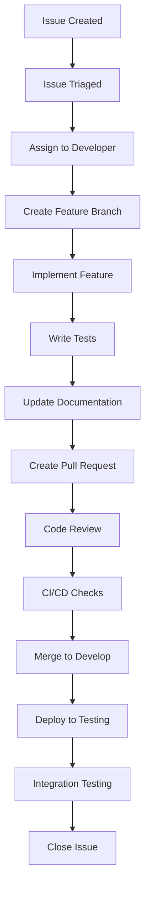

# Workflow Standards

This document defines our development workflow, branch management, and release processes for the Meta-Repo Seed project.

## 🔄 Development Workflow

### Standard Feature Development Cycle



### Workflow States

**Planning Phase**:
- Issue creation and triage
- Priority assignment
- Epic breakdown (if needed)
- Analysis tasks (if needed)

**Development Phase**:
- Branch creation
- Implementation
- Local testing
- Documentation updates

**Review Phase**:
- Pull request creation
- Code review
- CI/CD validation
- Feedback incorporation

**Integration Phase**:
- Merge to develop branch
- Integration testing
- Issue closure

## 🌿 Branch Management

### Branch Strategy
We use **Git Flow** with the following branches:

- **`main`**: Production-ready code
- **`develop`**: Integration branch for features
- **`feature/*`**: Individual feature development
- **`bugfix/*`**: Bug fixes
- **`hotfix/*`**: Critical production fixes
- **`docs/*`**: Documentation updates

### Branch Naming Conventions

**Feature Branches**:
```
feature/issue-{number}-{brief-description}
feature/issue-23-structure-json-analysis
feature/issue-26-workflow-documentation
```

**Bug Fix Branches**:
```
bugfix/issue-{number}-{brief-description}
bugfix/issue-42-template-encoding-error
```

**Documentation Branches**:
```
docs/issue-{number}-{topic}
docs/issue-25-api-documentation
```

**Hotfix Branches**:
```
hotfix/{version}-{description}
hotfix/1.0.1-security-patch
```

### Branch Lifecycle

1. **Create Branch** from `develop`
   ```bash
   git checkout develop
   git pull origin develop
   git checkout -b feature/issue-23-json-analysis
   ```

2. **Work on Feature**
   - Implement changes
   - Write tests
   - Update documentation
   - Commit regularly with clear messages

3. **Prepare for Review**
   ```bash
   git checkout develop
   git pull origin develop
   git checkout feature/issue-23-json-analysis
   git rebase develop  # or merge develop
   git push origin feature/issue-23-json-analysis
   ```

4. **Create Pull Request**
   - Fill out PR template completely
   - Link to related issue
   - Request appropriate reviewers

5. **After Merge**
   ```bash
   git checkout develop
   git pull origin develop
   git branch -d feature/issue-23-json-analysis
   ```

## 📋 Pull Request Standards

### PR Template Requirements

All PRs must include:

```markdown
## 🎯 Description
Brief description of changes

## 🔗 Related Issues
Fixes #issue-number

## 🧪 Testing
- [ ] Unit tests added/updated
- [ ] Integration tests updated
- [ ] Manual testing completed

## 📝 Documentation
- [ ] API docs updated
- [ ] User docs updated  
- [ ] README updated (if needed)
- [ ] Changelog entry added

## ✅ Checklist
- [ ] Code follows style guidelines
- [ ] Self-review completed
- [ ] No new warnings/errors
- [ ] All tests pass
```

### Code Review Checklist

**Functionality**:
- [ ] Code implements requirements correctly
- [ ] Edge cases handled appropriately
- [ ] Error handling is comprehensive
- [ ] Performance considerations addressed

**Code Quality**:
- [ ] Code is readable and well-structured
- [ ] Functions are focused and single-purpose
- [ ] Variable/function names are descriptive
- [ ] No code duplication without justification

**Testing**:
- [ ] Unit tests cover new functionality
- [ ] Tests cover edge cases and error conditions
- [ ] Integration tests updated if needed
- [ ] All tests pass locally

**Documentation**:
- [ ] Public APIs documented
- [ ] Complex logic explained with comments
- [ ] User-facing changes documented
- [ ] Examples provided for new features

## 🔍 Commit Standards

### Commit Message Format

```
type(scope): brief description

Longer description explaining the change in detail.
Include the reasoning behind the change and any
important implementation details.

Fixes #issue-number
Co-authored-by: Name <email@example.com>
```

### Commit Types

- **feat**: New feature
- **fix**: Bug fix
- **docs**: Documentation changes
- **style**: Code formatting (no functional changes)
- **refactor**: Code restructuring (no functional changes)
- **test**: Test additions or modifications
- **chore**: Build process, tooling, dependencies

### Scope Examples

- **core**: Core seeding functionality
- **config**: Configuration system
- **templates**: Template processing
- **github**: GitHub integration
- **cli**: Command-line interface
- **docs**: Documentation
- **tests**: Test infrastructure

### Example Commits

```bash
feat(config): add YAML configuration file support

Implement Configuration class with save/load methods
for YAML and JSON formats. Adds --config CLI parameter
and programmatic configuration management.

Fixes #5

fix(templates): handle encoding errors in template files

Add proper UTF-8 encoding handling when reading template
files to prevent UnicodeDecodeError on Windows systems.

Fixes #42

docs(api): update Configuration class documentation

Add comprehensive API documentation for new Configuration
class including usage examples and error handling patterns.

Relates to #25
```

## 🚀 Release Process

### Version Numbering
We follow **Semantic Versioning** (SemVer):

- **Major** (1.0.0 → 2.0.0): Breaking changes
- **Minor** (1.0.0 → 1.1.0): New features, backward compatible
- **Patch** (1.0.0 → 1.0.1): Bug fixes, backward compatible

### Release Workflow

1. **Prepare Release**
   ```bash
   git checkout develop
   git pull origin develop
   git checkout -b release/v1.1.0
   ```

2. **Update Version Information**
   - Update version in `seeding.py`
   - Update `docs/development/changelog.md`
   - Update `README.md` if needed

3. **Final Testing**
   - Run full test suite
   - Manual testing of key features
   - Documentation review

4. **Create Release PR**
   - PR from `release/v1.1.0` to `main`
   - Include changelog in PR description
   - Require approval from maintainers

5. **Release Deployment**
   ```bash
   git checkout main
   git merge release/v1.1.0 --no-ff
   git tag -a v1.1.0 -m "Release version 1.1.0"
   git push origin main --tags
   
   git checkout develop
   git merge main
   git push origin develop
   ```

6. **Post-Release**
   - Create GitHub release with changelog
   - Update project documentation
   - Announce release (if applicable)

### Hotfix Process

1. **Create Hotfix Branch** from `main`
   ```bash
   git checkout main
   git pull origin main  
   git checkout -b hotfix/v1.0.1-security-fix
   ```

2. **Implement Fix**
   - Minimal changes to address issue
   - Update version number
   - Update changelog

3. **Test Thoroughly**
   - Focused testing on the fix
   - Regression testing of related functionality

4. **Deploy Hotfix**
   ```bash
   git checkout main
   git merge hotfix/v1.0.1-security-fix --no-ff
   git tag -a v1.0.1 -m "Hotfix version 1.0.1"
   git push origin main --tags
   
   git checkout develop
   git merge main  # Merge hotfix back to develop
   git push origin develop
   ```

## 🔒 Security Considerations

### Security Review Requirements

For security-related changes:
- [ ] Security impact assessment completed
- [ ] Threat modeling updated (if applicable)
- [ ] Additional security review by senior developer
- [ ] Security testing performed

### Sensitive Information

**Never commit**:
- API keys, passwords, tokens
- Personal information
- Proprietary algorithms
- Production configuration

**Use instead**:
- Environment variables
- Configuration files (gitignored)
- Secret management systems
- Template variables with defaults

## 🧪 Testing Standards

### Test Categories

**Unit Tests** (`tests/unit/`):
- Test individual functions/methods
- Mock external dependencies
- Fast execution (<1s each)
- High coverage of core functionality

**Integration Tests** (`tests/integration/`):
- Test component interactions
- Use real (but controlled) dependencies
- Moderate execution time (<30s each)
- Cover critical workflows

**End-to-End Tests** (`tests/e2e/`):
- Test complete user scenarios
- Use production-like environment
- Longer execution time (minutes)
- Cover primary user journeys

### Test Execution

```bash
# Run all tests
python -m pytest

# Run specific test categories
python -m pytest tests/unit/
python -m pytest tests/integration/
python -m pytest tests/e2e/

# Run with coverage
python -m pytest --cov=seeding --cov-report=html

# Run specific test file
python -m pytest tests/unit/test_configuration.py

# Run tests matching pattern
python -m pytest -k "config"
```

### Test Requirements

- [ ] Unit tests for all new functions/methods
- [ ] Integration tests for new workflows
- [ ] Tests cover both success and failure scenarios
- [ ] Tests are deterministic and repeatable
- [ ] Test names clearly describe what they test

## 📊 Quality Metrics

### Code Quality Gates

**Before Merge**:
- [ ] All tests pass
- [ ] Code coverage >80% for new code
- [ ] No linting errors
- [ ] No security vulnerabilities
- [ ] Performance regression tests pass

**Release Quality**:
- [ ] Overall test coverage >85%
- [ ] Integration tests pass
- [ ] Documentation coverage >90%
- [ ] Performance benchmarks met

### Continuous Integration

Our CI pipeline enforces:
- Automated testing on all PRs
- Code coverage reporting
- Security vulnerability scanning
- Documentation build verification
- Cross-platform compatibility testing

## 🔧 Development Environment

### Required Tools

- **Python 3.8+**
- **Git** (latest version)
- **GitHub CLI** (for GitHub integration)
- **pytest** (testing framework)
- **Coverage.py** (coverage reporting)

### Recommended Setup

```bash
# Clone repository
git clone https://github.com/ChrisClements1987/meta-repo-seed.git
cd meta-repo-seed

# Create virtual environment
python -m venv venv
source venv/bin/activate  # On Windows: venv\Scripts\activate

# Install dependencies
pip install -r requirements-test.txt

# Install pre-commit hooks (if available)
pre-commit install

# Run initial tests
python -m pytest
```

### IDE Configuration

**VS Code** (recommended):
- Python extension
- pytest extension
- GitLens extension
- markdownlint extension

**PyCharm**:
- Configure pytest as test runner
- Enable code coverage
- Configure Git integration

## 📞 Support and Communication

### Getting Help

- **Technical Questions**: Open issue with `help-wanted` label
- **Process Questions**: Reference this documentation or ask in discussions
- **Security Issues**: Follow security disclosure process
- **Bug Reports**: Use bug report template

### Communication Channels

- **Issues**: Primary discussion for development work
- **Pull Requests**: Code review and implementation discussion
- **Discussions**: General questions and feature brainstorming
- **Wiki**: Long-term design documents and decisions

---

*This document is maintained by the development team and updated as our processes evolve. For questions or improvements, please open an issue with the `workflow` label.*