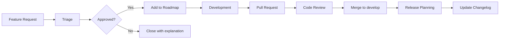

# Feature Development Workflow

This document describes the complete process for managing features in the Meta-Repo Seeding System.

## 📋 Process Overview

## 1️⃣ Feature Request Lifecycle

### Submission
- **Who**: Anyone (community, users, maintainers)
- **Where**: GitHub Issues using Feature Request template
- **What**: Structured information about the desired feature

### Initial Triage (Within 1 week)
- **Maintainer reviews** the request
- **Labels applied**: `enhancement`, `roadmap`, priority labels
- **Initial response** with questions or acknowledgment
- **Decision**: Accept, reject, or request more information

### Roadmap Integration (Within 2 weeks)
- **Approved features** added to `ROADMAP.md`
- **Priority assignment** based on:
  - User demand and impact
  - Technical complexity
  - Resource availability
  - Strategic alignment

## 2️⃣ Development Process

### Planning Phase
1. **Feature Analysis**: Break down into implementation tasks
2. **Technical Design**: Architecture and approach decisions
3. **Acceptance Criteria**: Define "done" conditions
4. **Estimation**: Effort and timeline assessment

### Implementation Phase
1. **Branch Creation**: `feature/issue-{number}-{short-description}`
2. **Development**: Code implementation with tests
3. **Documentation**: Update templates, README, or other docs
4. **Self-Review**: Test locally, run quality checks

### Review Phase
1. **Pull Request**: Create PR with detailed description
2. **Automated Checks**: CI/CD pipeline validation
3. **Code Review**: CODEOWNERS review and approval
4. **Feedback Integration**: Address review comments

## 3️⃣ Release Management

### Pre-Release
1. **Feature Complete**: All planned features implemented
2. **Testing**: Comprehensive testing of new functionality
3. **Documentation**: Update CHANGELOG.md and version numbers
4. **Release Branch**: Create release branch for final preparations

### Release
1. **Version Tag**: Create git tag (e.g., `v1.1.0`)
2. **GitHub Release**: Create release with notes
3. **Communication**: Announce new features to users

### Post-Release
1. **Roadmap Update**: Move completed items from roadmap
2. **Issue Closure**: Close related feature request issues
3. **Feedback Collection**: Monitor for issues or feedback

## 4️⃣ Priority Management

### High Priority (Next Release)
- **Critical user needs** or important functionality gaps
- **Dependencies** for other planned features
- **Quick wins** with high impact and low effort

### Medium Priority (Future Releases)
- **Valuable enhancements** that improve user experience
- **Technical improvements** that support long-term goals
- **Community requests** with good justification

### Low Priority (Backlog)
- **Nice-to-have features** that add value but aren't critical
- **Experimental ideas** that need validation
- **Complex features** requiring significant research

## 5️⃣ Communication Guidelines

### Feature Requests
- **Acknowledge** all requests within 1 week
- **Provide rationale** for acceptance or rejection decisions
- **Keep requesters informed** of progress and timeline changes

### Development Updates
- **Regular progress updates** on complex features
- **Transparent communication** about delays or blockers
- **Community involvement** in design discussions when appropriate

### Release Communication
- **Clear release notes** explaining new features and changes
- **Migration guides** for breaking changes
- **Examples and tutorials** for new functionality

## 6️⃣ Quality Standards

### Code Quality
- **Comprehensive testing** for all new features
- **Documentation coverage** for user-facing functionality
- **Backward compatibility** preservation when possible
- **Performance considerations** for resource usage

### User Experience
- **Intuitive interfaces** for new functionality
- **Clear error messages** and helpful guidance
- **Consistent behavior** with existing features
- **Accessibility considerations** for all users

---

## 📊 Metrics and Success Criteria

### Development Metrics
- Time from request to implementation
- Feature adoption rates after release
- Bug reports related to new features
- User satisfaction with new functionality

### Process Metrics
- Response time to feature requests
- Community engagement in discussions
- Pull request review cycle time
- Release frequency and predictability

---

*This workflow ensures systematic feature development while maintaining quality and community engagement.*